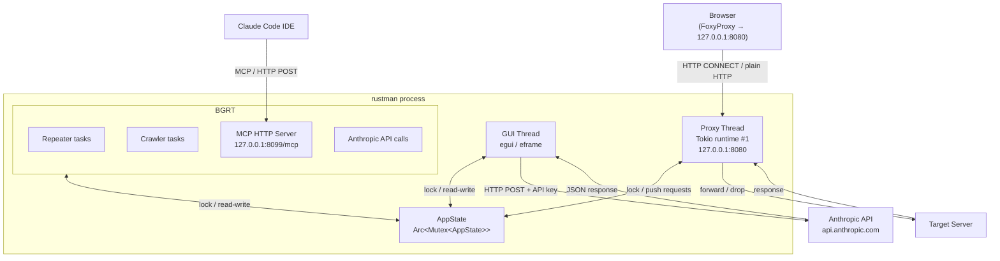
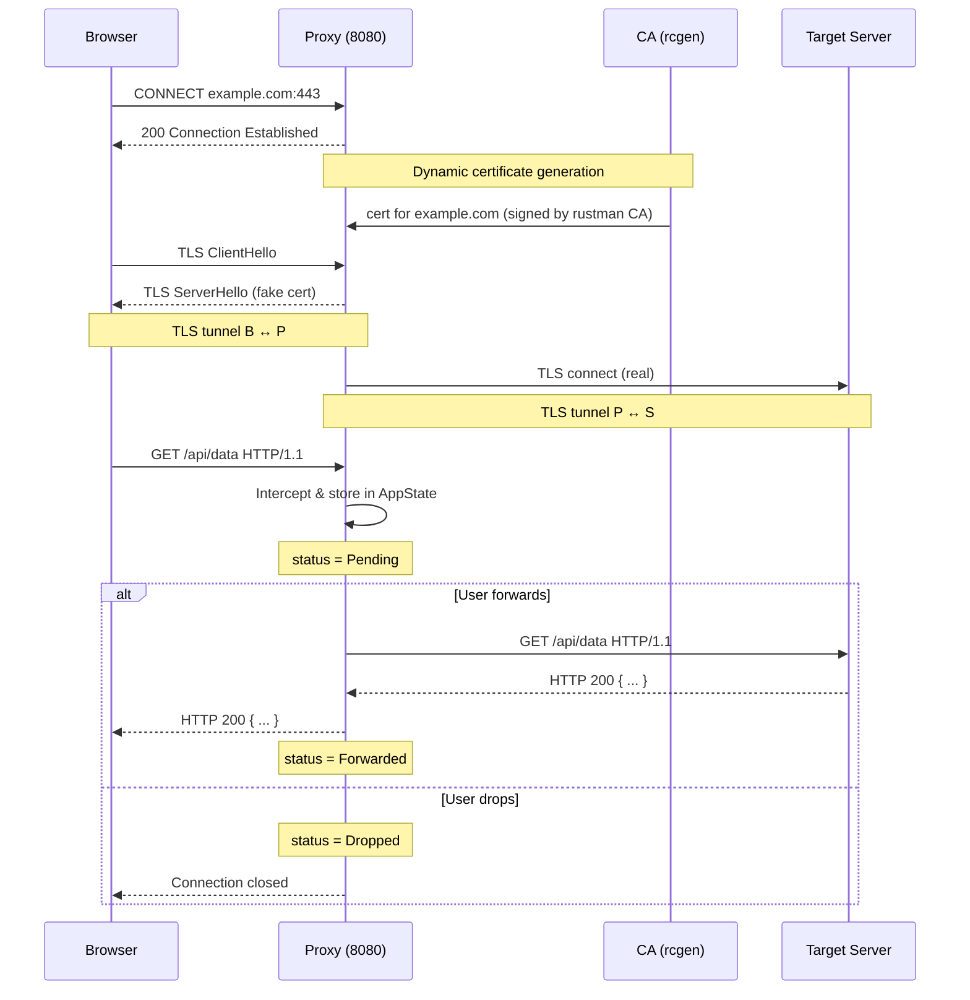
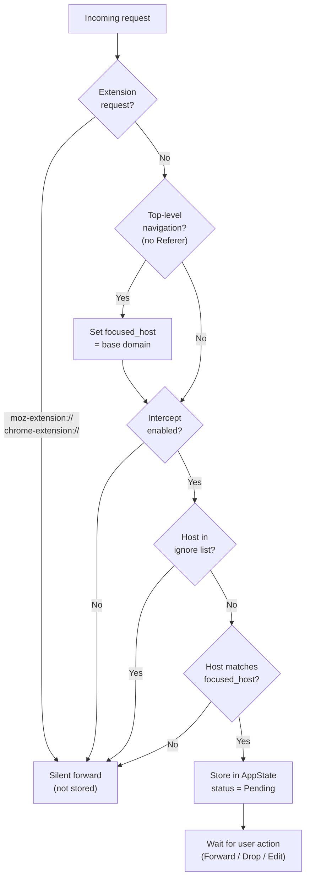
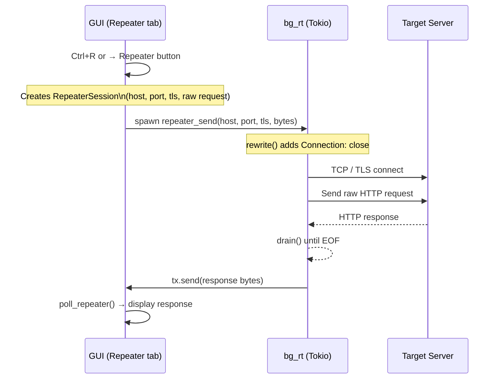
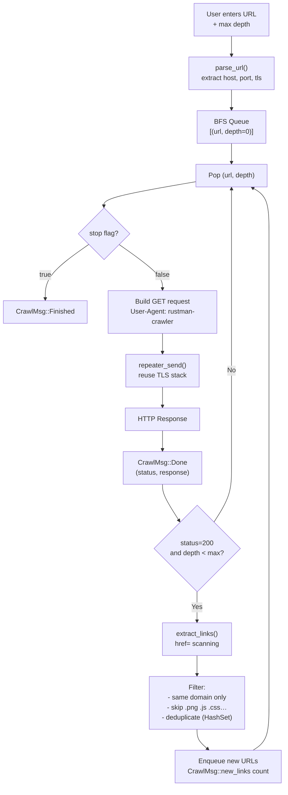
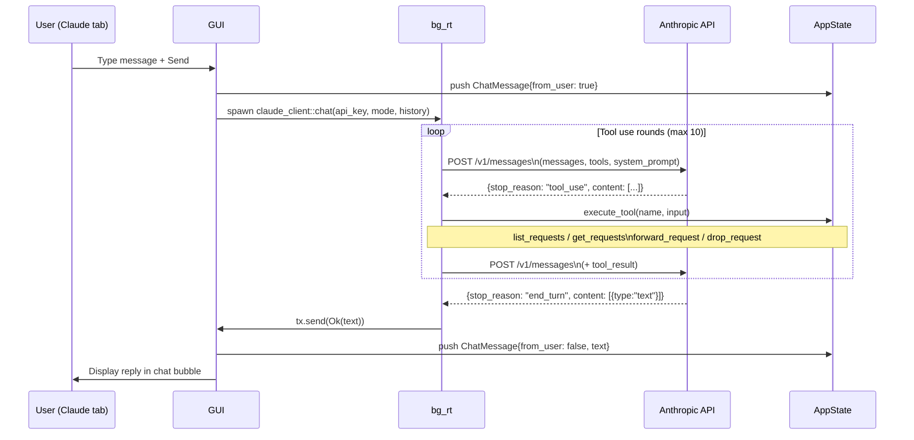
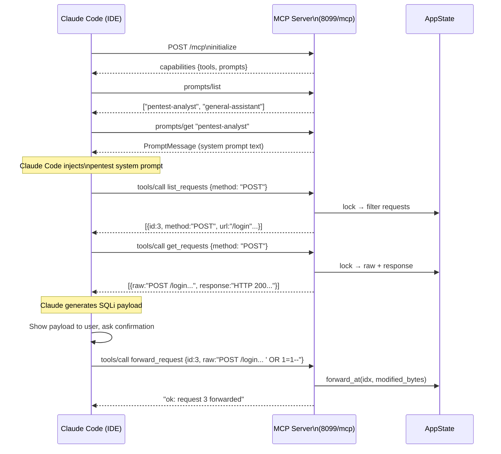
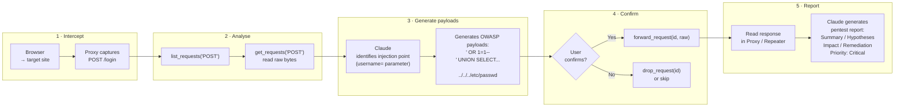

# rustman

A MITM proxy and web security testing tool written in Rust — similar to Burp Suite, with an integrated Claude AI assistant for OWASP-guided penetration testing.

---

## Features

| Module | Description |
|---|---|
| **Proxy** | Intercept, inspect, edit and forward/drop HTTP(S) requests in real time |
| **Repeater** | Replay and modify captured requests manually |
| **Crawler** | Recursive BFS link follower for a target domain |
| **Claude** | In-app AI assistant (Anthropic API) with Pentest mode |
| **MCP Server** | Expose proxy tools to Claude Code via Model Context Protocol |
| **Settings** | Intercept toggle, ignore list, API key, light/dark theme |

---

## Architecture



---

## MITM Proxy Flow



---

## Request Interception & Focus System



---

## Repeater Flow



---

## Crawler Flow



---

## Claude AI — Direct API Flow (Claude tab)



---

## MCP Server — Claude Code Integration



---

## OWASP Testing Workflow



---

## Setup

### 1. Install the CA certificate

On first launch, rustman generates a CA certificate and attempts to auto-install it into Firefox.

```
[rustman] CA cert: /home/<user>/.local/share/rustman/ca.pem
[rustman] proxy listening on 127.0.0.1:8080
[mcp] listening on http://127.0.0.1:8099/mcp
```

If auto-install fails:
```bash
sudo apt install libnss3-tools
# then restart rustman
```

For Chrome / system trust store, import `ca.pem` manually.

### 2. Configure your browser

Set your browser's HTTP/HTTPS proxy to `127.0.0.1:8080` (e.g. via FoxyProxy).

### 3. Configure Claude (optional)

Go to **Settings → CLAUDE API** and enter your Anthropic API key (`sk-ant-…`).

### 4. Connect Claude Code (optional)

Add to your Claude Code MCP config:

```json
{
  "mcpServers": {
    "rustman": {
      "type": "http",
      "url": "http://127.0.0.1:8099/mcp"
    }
  }
}
```

Then in Claude Code:
```
/mcp get prompt pentest-analyst
```

---

## Build

```bash
# Debug
cargo build

# Release
cargo build --release

# Windows executable (from Linux)
rustup target add x86_64-pc-windows-gnu
cargo build --release --target x86_64-pc-windows-gnu
```

---

## Keyboard shortcuts

| Shortcut | Action |
|---|---|
| `Ctrl+R` | Send selected request to Repeater |

---

## Tabs

### Proxy
Displays all intercepted requests for the focused host. Select a request to view and edit the raw bytes. Forward or drop individually, or use **Forward All** to release everything.

### Repeater
Manually replay requests with custom edits. Multiple sessions, each with its own request editor and response viewer.

### Crawler
Recursive BFS crawler for a target URL. Follows internal links only, skips static assets. Click any entry to inspect its request/response. Send directly to Repeater with **→ Repeater**.

### Claude
In-app AI assistant. Switch between **General** and **Pentest** modes. In Pentest mode every response follows the structured report format (Summary / Observations / Hypotheses / Validation / Impact / Remediation / Priority).

### Settings
| Setting | Description |
|---|---|
| Light mode | Toggle dark/light theme |
| Intercept | Enable or disable request interception |
| Ignore list | Hosts silently forwarded (substring match) |
| Proxy port | Read-only — set at startup |
| Max requests | Prune oldest completed requests when exceeded |
| Claude API key | Anthropic key for the Claude tab |

---

## Project structure

```
src/
├── main.rs          — entry point, proxy + MCP spawn
├── app.rs           — shared state (AppState, Request, Settings, ChatMessage)
├── proxy.rs         — MITM proxy, TLS interception, request routing
├── ca.rs            — dynamic certificate authority (rcgen)
├── gui.rs           — egui/eframe UI (all tabs)
├── repeater.rs      — (logic in proxy.rs repeater_send)
├── crawler.rs       — BFS web crawler
├── mcp.rs           — MCP HTTP server (tools + prompts)
└── claude_client.rs — Anthropic API client with tool-use loop
```
