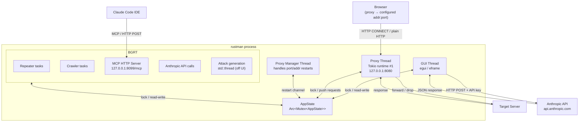
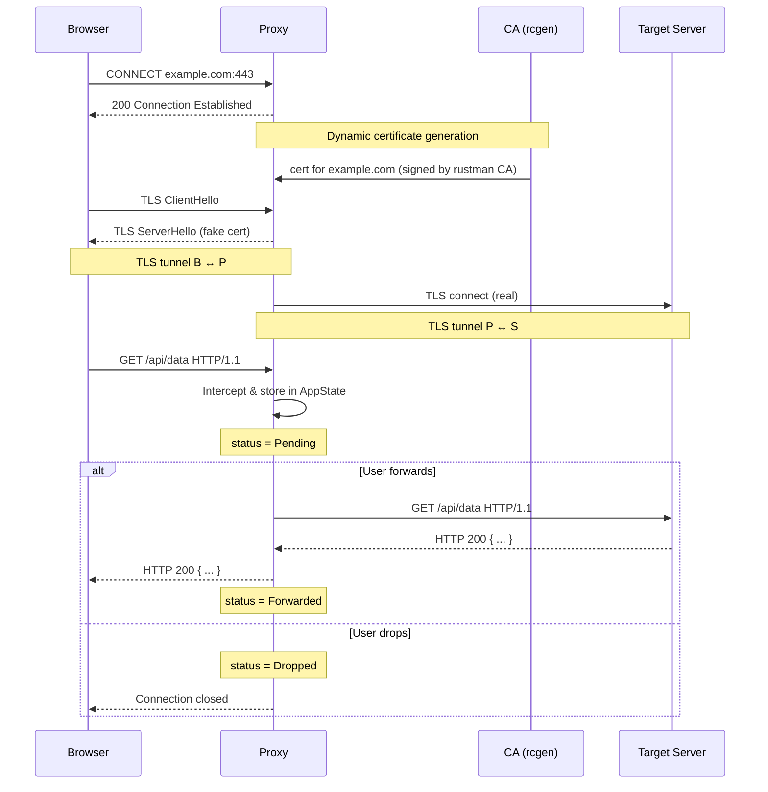
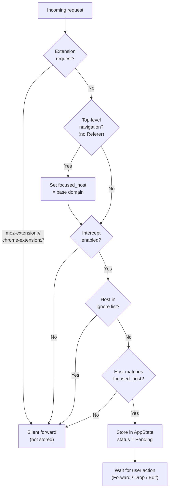
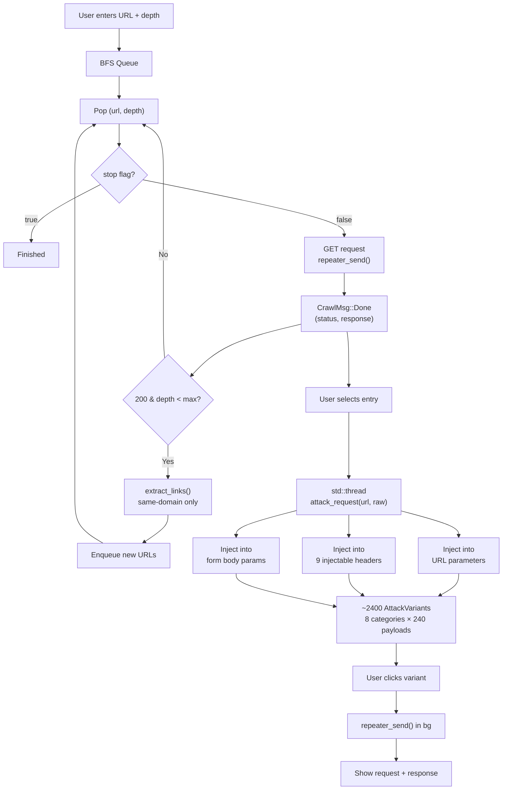
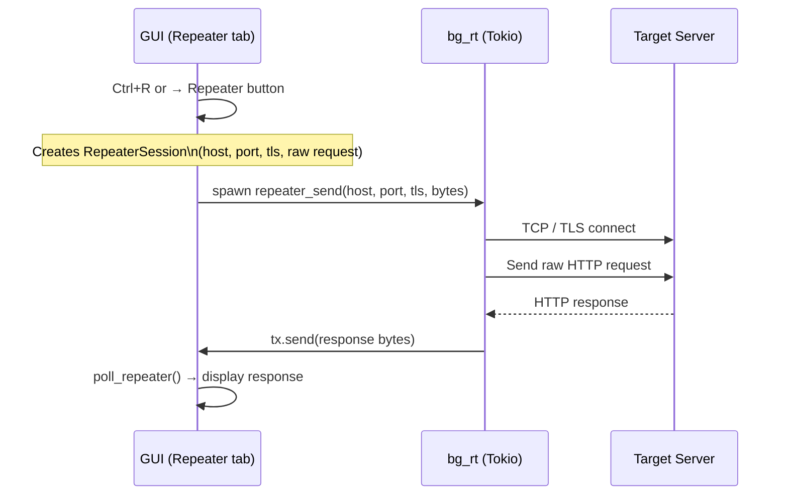
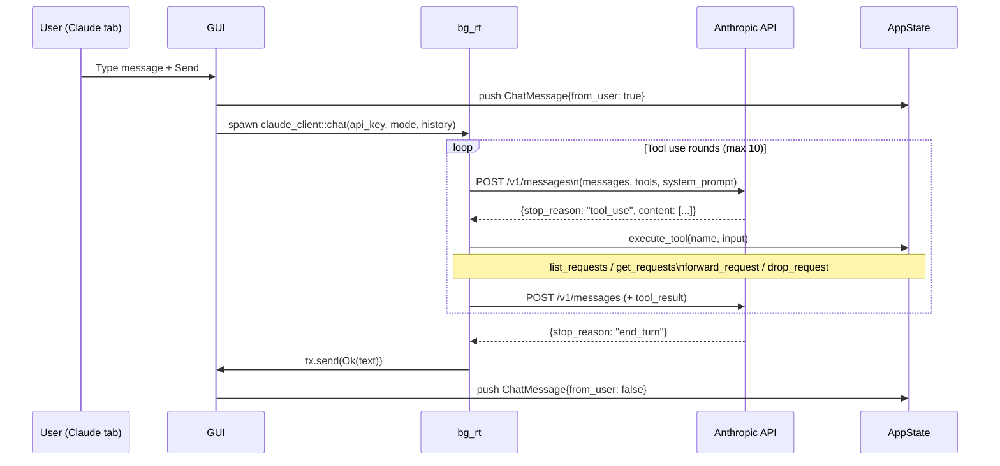
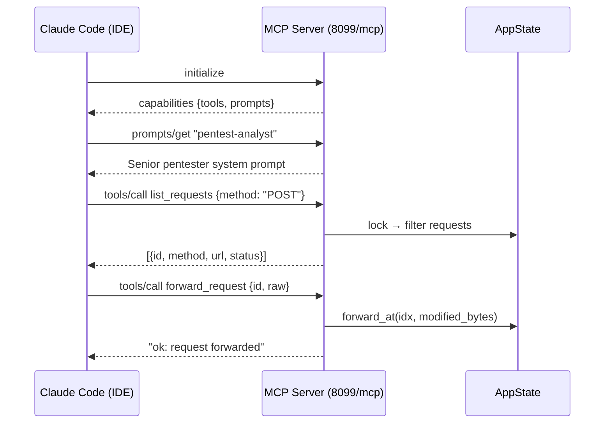

# rustman

**Rustman** is an open-source MITM proxy and web security testing tool built in Rust. It intercepts and inspects HTTP/HTTPS traffic, replays requests via a built-in Repeater, and crawls websites to automatically inject OWASP Top 10 payloads across URL parameters, headers, and request bodies. It features a native GUI, a Claude AI assistant for pentest analysis, and an MCP server for Claude Code integration.

---

## Features

| Module | Description |
|---|---|
| **Proxy** | Intercept, inspect, edit and forward/drop HTTP(S) requests in real time |
| **Repeater** | Replay and modify captured requests manually |
| **Crawler** | Recursive BFS crawler with automatic OWASP payload injection |
| **Attacks** | 240+ payloads per category injected into URL params, headers and body |
| **Claude** | In-app AI assistant (Anthropic API) with Pentest mode |
| **MCP Server** | Expose proxy tools to Claude Code via Model Context Protocol |
| **Settings** | Configurable bind address/port, intercept toggle, ignore list, theme |

---

## Architecture



---

## MITM Proxy Flow



---

## Request Interception & Focus System



---

## Crawler & Attack Flow



---

## OWASP Payload Categories

| Category | Payloads | Injection targets |
|---|---|---|
| **SQLi** | 30 | URL params, body, headers |
| **XSS** | 30 | URL params, body, headers |
| **CMDi** | 36 | URL params, body, headers |
| **Path Traversal** | 30 | URL params, body, headers |
| **SSRF** | 32 | URL params, body, headers |
| **SSTI** | 30 | URL params, body, headers |
| **Open Redirect** | 30 | URL params, body, headers |
| **RCE** | 30 | URL params, body, headers |

Payloads are embedded at compile time from `payload/*.json`. Headers tested: `User-Agent`, `Referer`, `X-Forwarded-For`, `X-Forwarded-Host`, `X-Real-IP`, `X-Custom-IP-Authorization`, `X-Original-URL`, `Accept-Language`, `Origin`.

---

## Repeater Flow



---

## Claude AI — Direct API Flow



---

## MCP Server — Claude Code Integration



**Available MCP tools:** `list_requests`, `get_requests`, `forward_request`, `drop_request`, `get_user_prompt`, `reply_to_user`

**Available MCP prompts:** `pentest-analyst`, `general-assistant`

---

## Setup

### 1. Install the CA certificate

On first launch rustman generates a CA certificate and attempts to auto-install it into Firefox.

```
[rustman] CA cert: /home/<user>/.local/share/rustman/ca.pem
[rustman] proxy listening on 127.0.0.1:8080
[mcp] listening on http://127.0.0.1:8099/mcp
```

If auto-install fails:
```bash
sudo apt install libnss3-tools
# then restart rustman
```

For Chrome / system trust store, import `ca.pem` manually.

### 2. Configure your browser

Set your browser HTTP/HTTPS proxy to the address shown in the top bar (default `127.0.0.1:8080`). The address and port can be changed at runtime in **Settings → Proxy**.

### 3. Configure Claude (optional)

Go to **Settings → Claude API** and enter your Anthropic API key (`sk-ant-…`).

### 4. Connect Claude Code (optional)

Add to your Claude Code MCP config:

```json
{
  "mcpServers": {
    "rustman": {
      "type": "http",
      "url": "http://127.0.0.1:8099/mcp"
    }
  }
}
```

---

## Build

```bash
# Debug
cargo build

# Release
cargo build --release

# Windows executable (from Linux, requires MinGW)
rustup target add x86_64-pc-windows-gnu
cargo build --release --target x86_64-pc-windows-gnu
```

> On Windows builds, `build.rs` automatically converts `logo.png` to a multi-size `.ico` and embeds it as the `.exe` resource icon.

---

## Keyboard shortcuts

| Shortcut | Action |
|---|---|
| `Ctrl+R` | Send selected request to Repeater |

---

## Tabs

### Proxy
Displays all intercepted requests for the focused host. Select a request to view and edit the raw bytes. Forward or drop individually, or use **Forward All** to release everything.

### Repeater
Manually replay requests with custom edits. Multiple sessions, each with its own request editor and response viewer.

### Crawler
Recursive BFS crawler. Click any entry to see its request/response. When a page finishes loading, attack variants are generated in a background thread — click any variant to fire the request and see the real server response side by side.

### Claude
In-app AI assistant. Switch between **General** and **Pentest** modes. In Pentest mode every response follows the structured report format: Summary / Observations / Hypotheses / Validation / Impact / Remediation / Priority.

### Settings

| Setting | Description |
|---|---|
| Light mode | Toggle dark/light theme |
| Intercept | Enable or disable request interception |
| Ignore list | Hosts silently forwarded (case-insensitive substring) |
| Proxy address | Bind IP — use `0.0.0.0` to expose on all interfaces |
| Proxy port | 1024–65535 — applied instantly without restart |
| Max requests | Prune oldest completed requests when the limit is reached |
| Claude API key | Anthropic key for the Claude tab |

---

## Project structure

```
rustman/
├── build.rs             — Windows .exe icon embedding (winres + ico)
├── logo.png             — Application logo (embedded at compile time)
├── payload/
│   ├── sqli.json
│   ├── xss.json
│   ├── cmdi.json
│   ├── path_traversal.json
│   ├── ssrf.json
│   ├── ssti.json
│   ├── open_redirect.json
│   └── rce.json
└── src/
    ├── main.rs          — Entry point, proxy manager thread, MCP spawn
    ├── app.rs           — Shared state (AppState, Request, Settings)
    ├── proxy.rs         — MITM proxy, TLS interception, stoppable accept loop
    ├── ca.rs            — Dynamic certificate authority (rcgen)
    ├── gui.rs           — egui/eframe UI (all tabs, adaptive repaint)
    ├── crawler.rs       — BFS crawler, OWASP attack generation
    ├── mcp.rs           — MCP HTTP server (tools + prompts)
    └── claude_client.rs — Anthropic API client with tool-use loop
```
