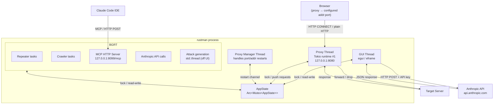
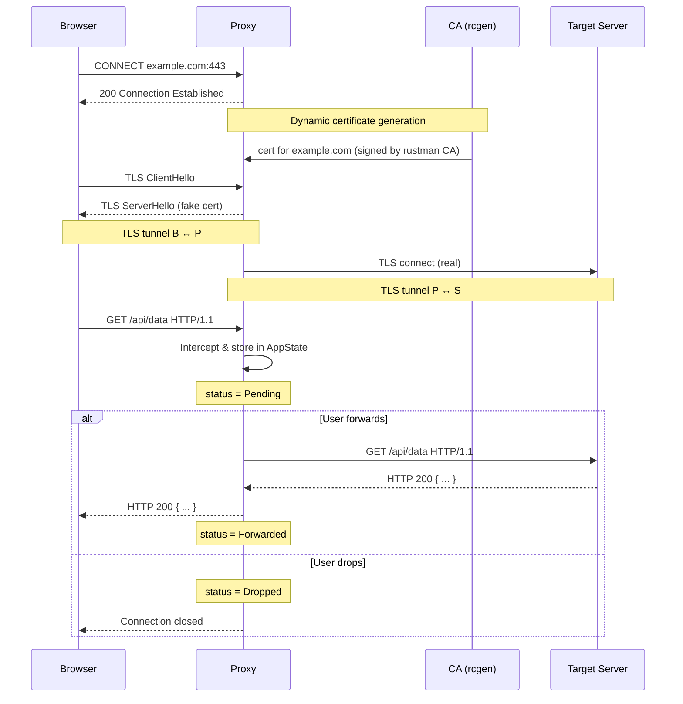
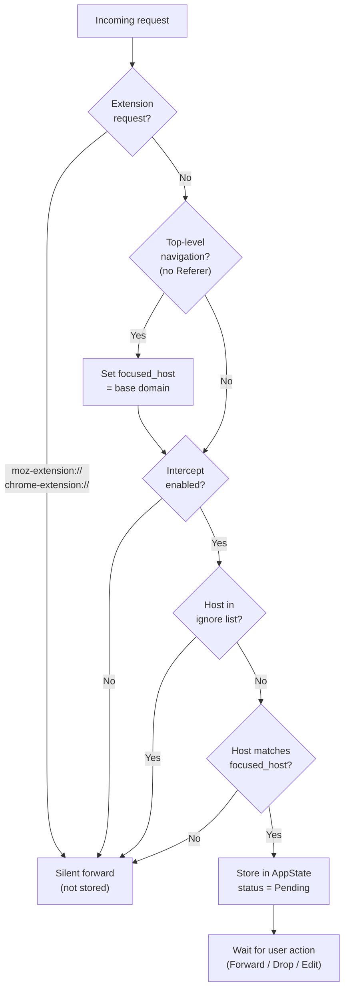
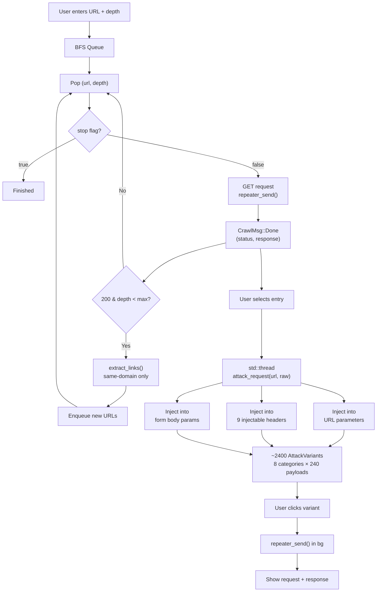
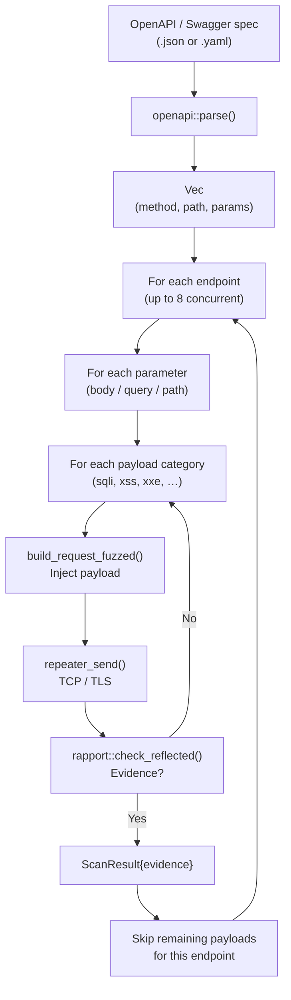
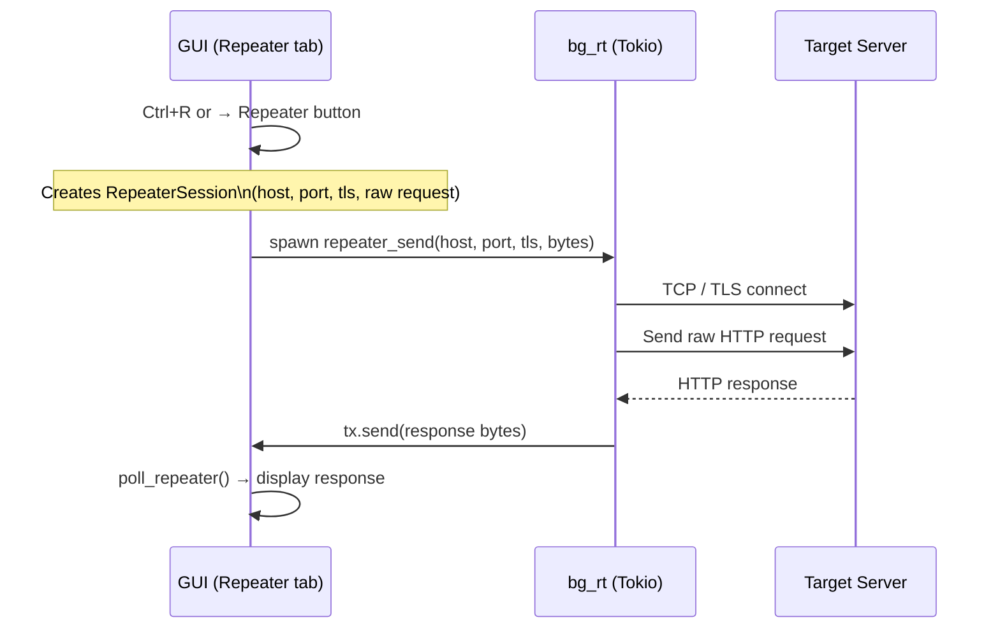
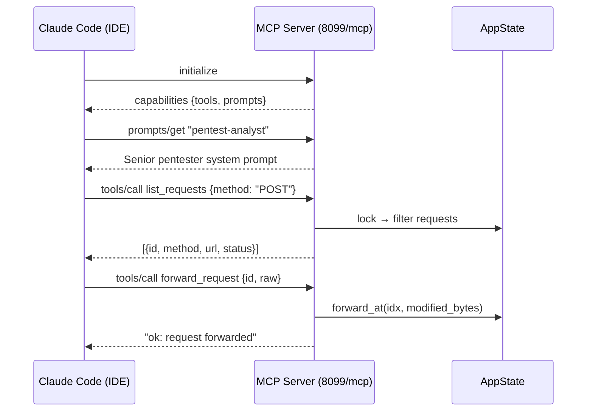

<p align="center">
  
</p>

# rustman

**Rustman** is an open-source MITM proxy and web security testing tool built in Rust. It intercepts and inspects HTTP/HTTPS traffic, replays requests via a built-in Repeater, and crawls websites to automatically inject OWASP Top 10 payloads across URL parameters, headers, and request bodies. It features a native GUI, a Claude AI assistant for pentest analysis, and an MCP server for Claude Code integration.

---

## Features

| Module | Description |
|---|---|
| **Proxy** | Intercept, inspect, edit and forward/drop HTTP(S) requests in real time |
| **Repeater** | Replay and modify captured requests manually |
| **Crawler** | Recursive BFS crawler with automatic OWASP payload injection |
| **Attacks** | 240+ payloads per category injected into URL params, headers and body |
| **OpenAPI Scanner** | Parse OpenAPI / Swagger specs and fuzz every endpoint and parameter |
| **CI/CD CLI** | Headless scan mode — pipe reports into pipelines, exit 1 on vuln |
| **Claude** | In-app AI assistant (Anthropic API key required) — dev/exploit mode |
| **MCP Server** | Expose proxy tools to Claude Code via Model Context Protocol |
| **Settings** | Configurable bind address/port, intercept toggle, ignore list, theme |

---

## Architecture



---

## MITM Proxy Flow



---

## Request Interception & Focus System



---

## Crawler & Attack Flow



---

## OWASP Payload Categories

| Category | File | Injection targets |
|---|---|---|
| **SQLi** | `sqli.json` | URL params, body, headers |
| **XSS** | `xss.json` | URL params, body, headers |
| **CMDi** | `cmdi.json` | URL params, body, headers |
| **Path Traversal** | `path_traversal.json` | URL params, body, headers |
| **SSRF** | `ssrf.json` | URL params, body, headers |
| **SSTI** | `ssti.json` | URL params, body, headers |
| **Open Redirect** | `open_redirect.json` | URL params, body, headers |
| **RCE** | `rce.json` | URL params, body, headers |
| **XXE** | `xxe.json` | URL params, body (XML endpoints) |

Payloads are loaded at runtime from `payload/*.json` — add or edit any file to extend coverage. Headers tested by the crawler: `User-Agent`, `Referer`, `X-Forwarded-For`, `X-Forwarded-Host`, `X-Real-IP`, `X-Custom-IP-Authorization`, `X-Original-URL`, `Accept-Language`, `Origin`.

---

## OpenAPI Scanner

The OpenAPI Scanner parses an OpenAPI 3.x or Swagger 2.x specification (JSON or YAML), enumerates every endpoint and parameter, and fuzzes them with all payload categories.

### Scan behaviour

- **All parameter locations** — query params, body fields (JSON / form), path params
- **Early stop per endpoint** — once a vulnerability is confirmed on an endpoint, remaining payloads for that endpoint are skipped (no duplicate findings)
- **Concurrent** — up to 8 endpoints scanned in parallel (configurable)
- **Evidence-based** — a finding is only confirmed when the response contains payload-specific markers; HTTP 302 / 404 / 0 are treated as false positives

### OpenAPI Scanner flow



---

## CI/CD — Headless mode

Rustman can run as a pure CLI scanner — no GUI, no proxy — for integration into automated pipelines.

### Usage

```bash
# Basic scan — Markdown report on stdout
cargo run -- --openapi spec.yaml --target http://staging-api:8080

# Write a Markdown report (format inferred from extension)
cargo run -- --openapi spec.yaml --target http://api --output report.md

# JSON report for downstream parsing
cargo run -- --openapi spec.yaml --target http://api --output report.json

# Fail the pipeline if vulnerabilities are found
cargo run -- --openapi spec.yaml --target http://api \
  --output report.md --fail-on-vuln

# With authentication
cargo run -- --openapi spec.yaml --target http://api \
  --bearer "$TOKEN" --fail-on-vuln

# All options
cargo run -- --openapi spec.yaml --target http://api \
  --payload-dir ./payload \
  --format json \
  --output report.json \
  --fail-on-vuln \
  --concurrency 8 \
  --bearer "$TOKEN" \
  --cookie "session=abc123" \
  --api-key-header X-Api-Key \
  --api-key-value "$KEY"
```

### Options

| Flag | Default | Description |
|---|---|---|
| `--openapi <file>` | — | OpenAPI / Swagger spec (JSON or YAML) **required** |
| `--target <url>` | spec `servers[0]` | Target base URL |
| `--payload-dir <dir>` | `./payload` | Directory containing `*.json` payload files |
| `--format <markdown\|json>` | inferred from `--output`, else `markdown` | Output format |
| `--output <file>` | stdout | Write report to file |
| `--fail-on-vuln` | off | Exit `1` when vulnerabilities are confirmed |
| `--concurrency <n>` | `8` | Maximum parallel endpoint scans |
| `--bearer <token>` | — | `Authorization: Bearer` header |
| `--cookie <value>` | — | `Cookie` header |
| `--api-key-header <name>` | — | Custom header name |
| `--api-key-value <value>` | — | Custom header value |

### Exit codes

| Code | Meaning |
|---|---|
| `0` | Clean — no vulnerabilities found |
| `1` | Vulnerabilities confirmed (only with `--fail-on-vuln`) |
| `2` | Usage / configuration error |
| `3` | Scan error (bad spec, connection refused, …) |

### Docker

```bash
# Build
docker build -t rustman-scanner .

# Scan — Markdown report on stdout
docker run --rm rustman-scanner \
  --openapi /dev/stdin \
  --target http://api:8080 < spec.yaml

# Mount spec + write report to host
docker run --rm \
  -v $(pwd)/spec.yaml:/app/spec.yaml \
  -v $(pwd)/reports:/reports \
  rustman-scanner \
    --openapi /app/spec.yaml \
    --target http://api:8080 \
    --output /reports/report.md \
    --fail-on-vuln
```

> The runtime image is based on `debian:bookworm-slim` and contains only glibc + CA certificates (~30 MB total). No X11 or OpenGL packages are required — GUI code is never invoked in CLI mode.

#### Scanning an API running on the host machine

From inside a container, `localhost` refers to the container itself, not the host. Use one of the following approaches:

**Option 1 — `--network host` (Linux only, simplest)**

```bash
docker run --rm \
  --network host \
  -v $(pwd)/vuln-api/openapi.yml:/app/spec.yaml \
  -v $(pwd)/reports:/reports \
  rustman-scanner \
    --openapi /app/spec.yaml \
    --target http://localhost:8090 \
    --output /reports/report.md \
    --fail-on-vuln
```

The container shares the host network stack directly — `localhost:8090` resolves to your host API.

**Option 2 — `host.docker.internal` (works on all platforms)**

```bash
docker run --rm \
  --add-host host.docker.internal:host-gateway \
  -v $(pwd)/vuln-api/openapi.yml:/app/spec.yaml \
  -v $(pwd)/reports:/reports \
  rustman-scanner \
    --openapi /app/spec.yaml \
    --target http://host.docker.internal:8090 \
    --output /reports/report.md \
    --fail-on-vuln
```

`--add-host host.docker.internal:host-gateway` is required on Linux (Mac/Windows have it automatically).

**Option 3 — Docker Compose (recommended for CI/CD)**

Put the API and scanner in the same Compose project — they can reach each other by service name:

```yaml
services:
  api:
    build: ./vuln-api
    ports:
      - "8090:8090"

  scanner:
    image: rustman-scanner
    depends_on:
      - api
    volumes:
      - ./vuln-api/openapi.yml:/app/spec.yaml
      - ./reports:/reports
    command: >
      --openapi /app/spec.yaml
      --target http://api:8090
      --output /reports/report.md
      --fail-on-vuln
```

```bash
docker compose up --exit-code-from scanner
```

### GitHub Actions example

```yaml
- name: Build scanner
  run: docker build -t rustman-scanner .

- name: Security scan
  run: |
    docker run --rm \
      -v ${{ github.workspace }}:/workspace \
      rustman-scanner \
        --openapi /workspace/docs/openapi.yaml \
        --target ${{ env.STAGING_URL }} \
        --output /workspace/security-report.md \
        --fail-on-vuln

- name: Upload report
  if: always()
  uses: actions/upload-artifact@v4
  with:
    name: security-report
    path: security-report.md
```

### GitLab CI example

```yaml
security-scan:
  image: docker:latest
  services:
    - docker:dind
  script:
    - docker build -t rustman-scanner .
    - docker run --rm
        -v $CI_PROJECT_DIR:/workspace
        rustman-scanner
          --openapi /workspace/docs/openapi.yaml
          --target $STAGING_URL
          --output /workspace/gl-sast-report.md
          --fail-on-vuln
  artifacts:
    when: always
    paths:
      - gl-sast-report.md
```

---

## Repeater Flow



---

## MCP Server — Claude Code Integration



**Available MCP tools:** `list_requests`, `get_requests`, `forward_request`, `drop_request`, `get_user_prompt`, `reply_to_user`

**Available MCP prompts:** `pentest-analyst`, `general-assistant`

---

## Setup

### 1. Install the CA certificate

On first launch rustman generates a CA certificate and attempts to auto-install it into Firefox.

```
[rustman] CA cert: /home/<user>/.local/share/rustman/ca.pem
[rustman] proxy listening on 127.0.0.1:8080
[mcp] listening on http://127.0.0.1:8099/mcp
```

If auto-install fails:
```bash
sudo apt install libnss3-tools
# then restart rustman
```

For Chrome / system trust store, import `ca.pem` manually.

### 2. Configure your browser

Set your browser HTTP/HTTPS proxy to the address shown in the top bar (default `127.0.0.1:8080`). The address and port can be changed at runtime in **Settings → Proxy**.

### 3. Configure Claude (optional)

Go to **Settings → Claude API** and enter your Anthropic API key (`sk-ant-…`).

### 4. Connect Claude Code (optional)

Add to your Claude Code MCP config:

```json
{
  "mcpServers": {
    "rustman": {
      "type": "http",
      "url": "http://127.0.0.1:8099/mcp"
    }
  }
}
```

---

## Build

```bash
# Debug
cargo build

# Release
cargo build --release

# Windows executable (from Linux, requires MinGW)
rustup target add x86_64-pc-windows-gnu
cargo build --release --target x86_64-pc-windows-gnu
```

> On Windows builds, `build.rs` automatically converts `logo.png` to a multi-size `.ico` and embeds it as the `.exe` resource icon.

---

## Keyboard shortcuts

| Shortcut | Action |
|---|---|
| `Ctrl+R` | Send selected request to Repeater |

---

## Tabs

### Proxy
Displays all intercepted requests for the focused host. Select a request to view and edit the raw bytes. Forward or drop individually, or use **Forward All** to release everything.

### Repeater
Manually replay requests with custom edits. Multiple sessions, each with its own request editor and response viewer.

### Crawler
Recursive BFS crawler. Click any entry to see its request/response. When a page finishes loading, attack variants are generated in a background thread — click any variant to fire the request and see the real server response side by side.

### Settings

| Setting | Description |
|---|---|
| Light mode | Toggle dark/light theme |
| Intercept | Enable or disable request interception |
| Ignore list | Hosts silently forwarded (case-insensitive substring) |
| Proxy address | Bind IP — use `0.0.0.0` to expose on all interfaces |
| Proxy port | 1024–65535 — applied instantly without restart |
| Max requests | Prune oldest completed requests when the limit is reached |
| Claude API key | Anthropic key for the Claude tab |

---

## Project structure

```
rustman/
├── build.rs             — Windows .exe icon embedding (winres + ico)
├── logo.png             — Application logo (embedded at compile time)
├── payload/             — Payload files loaded at runtime (add/edit freely)
│   ├── sqli.json
│   ├── xss.json
│   ├── cmdi.json
│   ├── path_traversal.json
│   ├── ssrf.json
│   ├── ssti.json
│   ├── open_redirect.json
│   ├── rce.json
│   └── xxe.json
└── src/
    ├── main.rs          — Entry point: routes to CLI or GUI mode
    ├── cli.rs           — Headless CLI scanner (CI/CD mode)
    ├── app.rs           — Shared state (AppState, Request, Settings)
    ├── proxy.rs         — MITM proxy, TLS interception, stoppable accept loop
    ├── ca.rs            — Dynamic certificate authority (rcgen)
    ├── gui.rs           — egui/eframe UI (all tabs, OpenAPI scanner UI)
    ├── openapi.rs       — OpenAPI / Swagger parser, payload loader, request builder
    ├── rapport.rs       — Evidence detection, false-positive filter, PDF/MD report gen
    ├── crawler.rs       — BFS crawler, OWASP attack generation
    ├── mcp.rs           — MCP HTTP server (tools + prompts)
    └── claude_client.rs — Anthropic API client with tool-use loop
```
